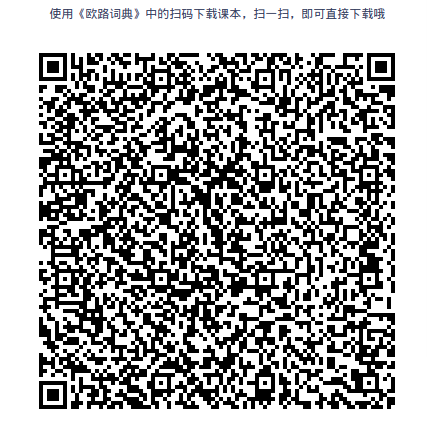

## 2020恋练有词考研英语词汇

* 《2020恋练有词考研英语词汇》并按单元分类

* 单词来源：we_learn词根词缀词典微信小程序

* get_words.py的代码同时也可以用于爬取小程序中的其他词典，不过可能需要先抓包获取token和uid

* 欧路词典用户可以直接扫码加入单词课本(ps.添加到词典之后不知道为什么少了一部分单词，发现缺少的单词请联系我1449902124@qq.com)

